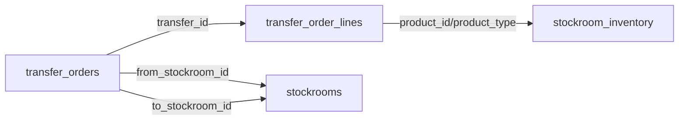
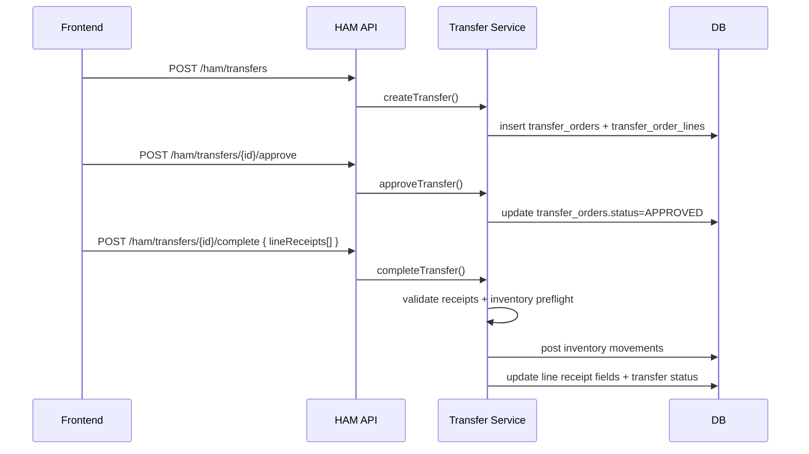
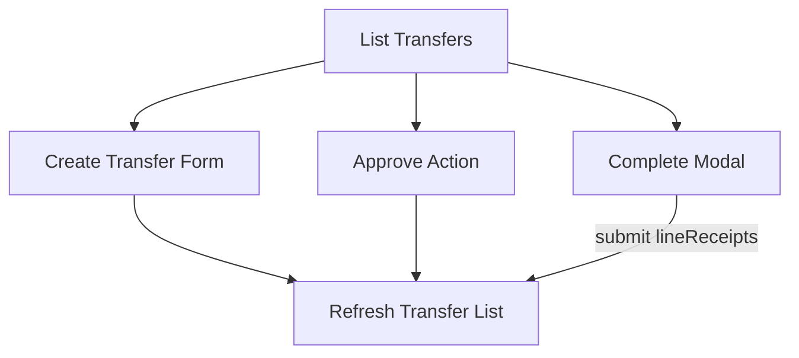

# Transfer Data Flow (DB -> API -> Frontend)

Date: 2026-03-02

## 1) Entity Flow

Key invariants:
- `transfer_orders.status` lifecycle must follow valid transitions.
- `transfer_order_lines.line_id` is the authoritative key for completion receipts.
- Source inventory cannot go negative.
- Destination inventory increments by good quantity (`received - damaged`).

## 2) API Flow

## 3) Frontend State Flow

Frontend sync rules:
- Completion UI must submit valid `lineReceipts` keyed by backend `lineId`.
- Completion validation blocks invalid damaged/received combinations before API call.
- Building/stockroom display prefers explicit API linkage and keeps controlled fallback for legacy records.

